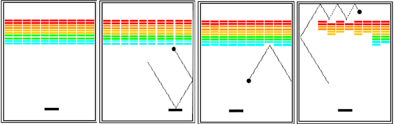
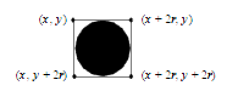

COMP 127 HW 4:  Breakout!
==========================

For this homework assignment, you will write a program to play the classic arcade game of Breakout. In Breakout, your goal is to clear a collection of bricks by hitting each of them with a bouncing ball.

Breakout was developed in 1976 by Steve Wozniak, shortly before he cofounded Apple Computer, Inc. He [cited the experience of building the game](https://archive.org/stream/byte-magazine-1984-12/1984_12_BYTE_09-13_Communications#page/n461/mode/2up) as part of his inspiration in creating the Apple ][, the first commercially viable home computer.

## The game 

The initial configuration of the Breakout game appears in the left image below. The colored 
rectangles in the top part of the screen are bricks in a wall: two rows each of red, orange, yellow, green, and cyan.
These colors are not required; you can choose to be creative about the colors and the size of the bricks
and the number of bricks in each row.

The slightly larger rectangle at the bottom is the paddle. The paddle is in a fixed position in the vertical 
dimension, but moves back and forth horizontally across the screen along with the mouse until it reaches the edge of its space.

A complete Breakout game consists of three turns, or lives. On each turn, a ball is launched from the center 
of the window towards the bottom of the screen at a random angle. That ball bounces off of the paddle and the “side walls” 
of the world (left, right, and top). Thus, after two bounces — one off of the paddle and one off of the right side — the ball 
might have the trajectory shown in the second diagram. (*Note that the dotted line is illustrative to show the 
ball’s path. The dotted line won’t appear on the screen.*)

In the second diagram, the ball is about to collide with one of the bricks on the bottom row
of the brick wall. 
When that happens, the ball 
bounces just as it does on any other collision, but the brick disappears. The third diagram shows what the game 
looks like after that collision and after you have moved the paddle to line it up with the 
oncoming ball. The play continues in this way until one of the following conditions occurs:

- The ball moves below the paddle, which means that the player must have missed it with the paddle. In this case, 
the turn ends and the next ball is served, assuming that you have not already exhausted your allotment of
three turns. If you have, the game ends in a loss.
- The last brick is eliminated. In this case, the game ends immediately, and you can retire in victory.

## Some implementation notes

You have license to vary the brick wall’s size and placement and the spacing between it and the sides.
Your final product must have several rows of bricks in the brick wall.

Make good use of named constants for dimensions and for other details, such as how long to pause between each movement
of the ball, which causes the game to go faster or slower, depending on how it is set.

To start the game, you can place the ball in the center and wait for 3 seconds, then begin the ball moving down 
towards one side or the other at an angle.

When a player loses a turn (or life), you can implement similar behavior: place the ball back in the center and wait 
for 3 seconds before starting the ball on its way downwards again.

After all the bricks in a particular column have been cleared, a path will open to the top edge of the window. When this 
delightful situation occurs, the ball will often bounce back and forth several times between the top and the upper 
line of bricks without the user ever having to worry about hitting the ball with the paddle. This condition is the 
reward for “breaking out” and gives meaning to the name of the game.
Note that even though breaking out is a very exciting part of the player’s experience,
you don’t have to do anything special in your program to make it happen. The game is operated by the same rules as always:
bouncing off sides or top, clearing bricks from the brick wall by checking if the ball has hit them, and obeying the laws of physics.

Given the ball is not a single point, it is not sufficient to check only the coordinates of the center. In this program, 
the simplest strategy is to check the four corner points on the square in which the ball is inscribed. The fact that an `Ellipse`
is defined in terms of its bounding rectangle means that if the upper left corner of the ball is at point (x,y), the other corners will be at the locations
shown in this diagram:

One tricky part of this assignment is the problem of checking to see 
whether the ball has collided with a brick or the paddle. The easiest strategy to adopt 
is to call the `getElementAt()` method of `CanvasWindow` or `GraphicsGroup`, which returns the object showing at a given point on the canvas. Call this method at the edge of the ball, and if the value you get back 
is not null, you have a collision with either a brick or the paddle. 

Because `getElementAt()` tests only a single point, you will need to call it with multiple locations to figure out which side of the ball hit an object. You have two choices for how two handle this:

- You can use the four midpoints of the square’s sides, i.e. the four “compass points” of the pass. This has the advantage of easily distinguishing the four sides. However, if you call `getElementAt()` with a point right on the ball’s edge, you will always get the ball itself, so you will have to figure out how to test points very slightly _outside_ the ball.
- You can use the four corners of the square in the picture above. These points have the advantage of being outside the ball, which means that `getElementAt` won’t return the ball itself. However, testing the corner makes the logic more complicated. For example, if the upper left corner of the rectangle detects a collision, did the ball hit something above or something to the left?

## Program design

We expect you to decompose your program into at least three separate classes in addition to the main `BreakoutGame` class. 
Excellent designs will have at least four. Your goal is to achieve a _good division of labor_. It is a bad sign if you have one giant class that does most of the work. It is a good sign if each class has some logic of its own, and each class serves its own separate purpose.

To accomplish this, you should read through the above problem description of the game and pull out all of the significant 
nouns that describe major objects that are part of the game. This will help you spot potential classes.

As you develop each class, practice good method decomposition to avoid code duplication, and keep your 
methods short, with a single clear purpose and a name that clearly expresses that purpose.

Remember the refactoring skills you have learned. It is always a good strategy to **get _something_ working, then refactor it.**

Please pay special attention to the [Comp 127 Style Guide](https://docs.google.com/document/d/1KB3T5can3aC5qygtdjKTUzl0P3c8BlN1QaWy4rIc2F0/edit?usp=sharing).

Because this program is entirely graphical, you do not need to write JUnit tests; however, you may if writing tests helps you develop the logic. You should make sure you test thoroughly by playing the game.

## Due Dates

This homework will have three milestones:

* **Part 1**: You will complete a class diagram with important instance variables and methods shown on the diagram.
This is so that we can discuss this together and compare designs either in a class or lab session.

* **Part 2**: For this milestone you only need to draw the graphical objects on the screen and have the ball animate. 
Your ball should be able to reflect off of the top, sides, and bottom, but does not need to test for intersections with 
bricks in the brick wall 
or the paddle. You will push this working code.

* **Part 3**: For this milestone you should commit and push the completed assignment. The ball should be able to bounce 
off of the paddle and intersect bricks. The paddle should be able to move with the mouse or keyboard. 
The game should end when all the bricks disappear or the player loses three lives. 

To receive full credit, you must have:
* Correct execution:
  * Ball / brick intersections
  * Ball / side intersections
  * Ball / paddle intersections
  * Win / lose logic
* Good class decomposition
* Good method decomposition
* Good code style

### Attribution

This assignment and some of the description text come from *The Art and Science of Java* by Eric Roberts.
